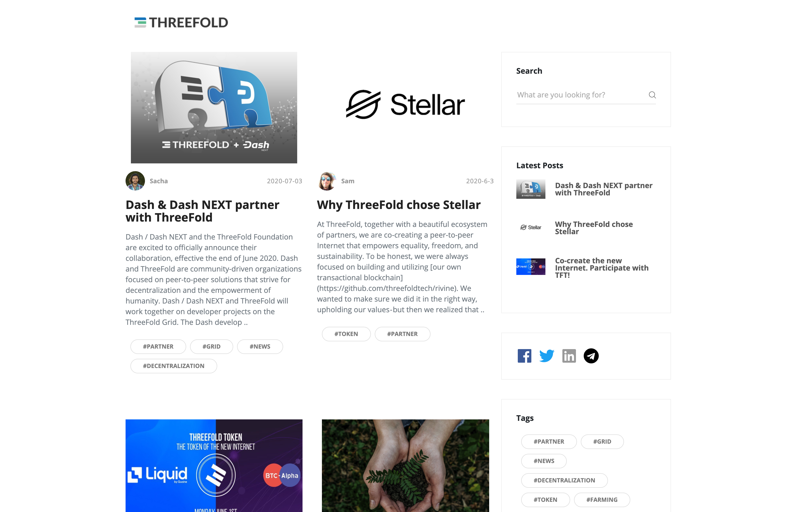

## Publisher Blog

Powerful blog system based on markdown & wiki.
Our own blog system has been made with it.

See: https://blog.threefold.io/

Link to some more info? TODO:

### Deploy

create widget which does following,
widget needs to be here in iframe

- [ ] size: small/mid/large
  - small limited amount of visitors per month
  - large ...
- [ ] location (mention more locations coming soon)
  - Ghent
  - Vienna
- [ ] name
  - name as used in solution (in the webui and on web)
- [ ] domain (name is prefix of this)
  - ava.tf
  - 3x0.me
  - refit.earth
  - co30.org
  - ninja.tf
  - base.tf
  - tf9.io
- [ ] git url
  - check in wizard git url works
- [ ] sshkey yes/no
  - if yes, ask sshkey for remote login

  - always deploy on ipv6 public
  - always deploy on webgateway

## Manual

- link to manual (TODO: check good enough)

