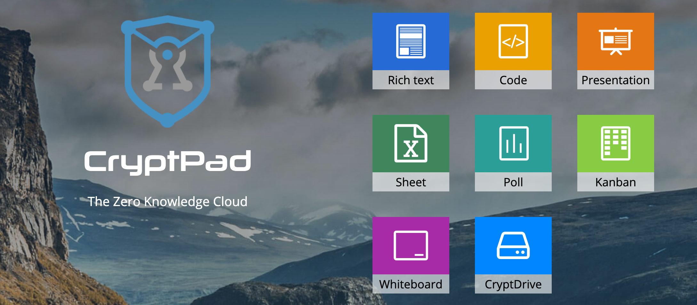

# PUBLISHING TOOLS 

# Cryptpad

CryptPad is a private-by-design alternative to popular office tools and cloud services. All the content stored on CryptPad is encrypted before being sent, which means nobody can access your data unless you give them the keys (not even us).

The ThreeFold team uses it for internal documents and collaboration, and now so can end-users on the ThreeFold Grid.

Support cryptpad at https://cryptpad.fr/index.html

## How to Use

1) From the ThreeFold Now Solutions menu, click on the "CryptPad" button

2) Using the guided walkthrough, setup where you want your Solution to be hosted

3) Get started with creating documents with CryptPad! 
