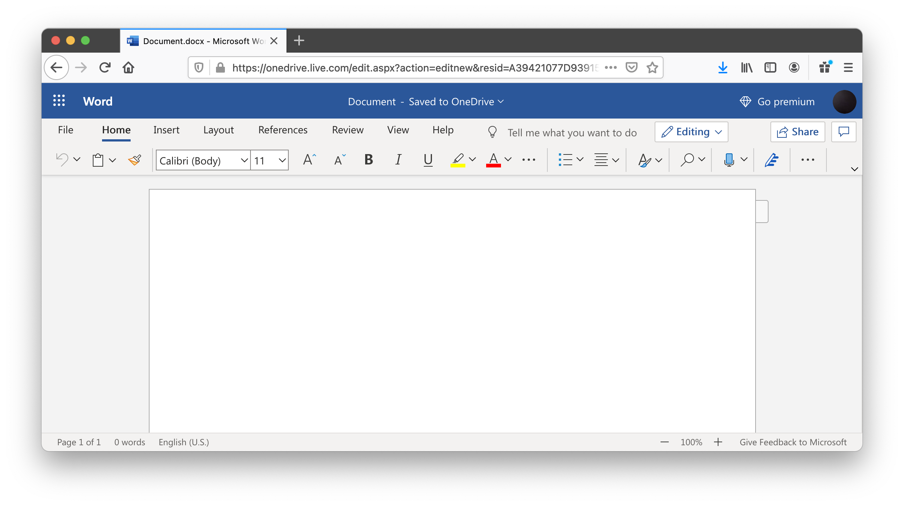
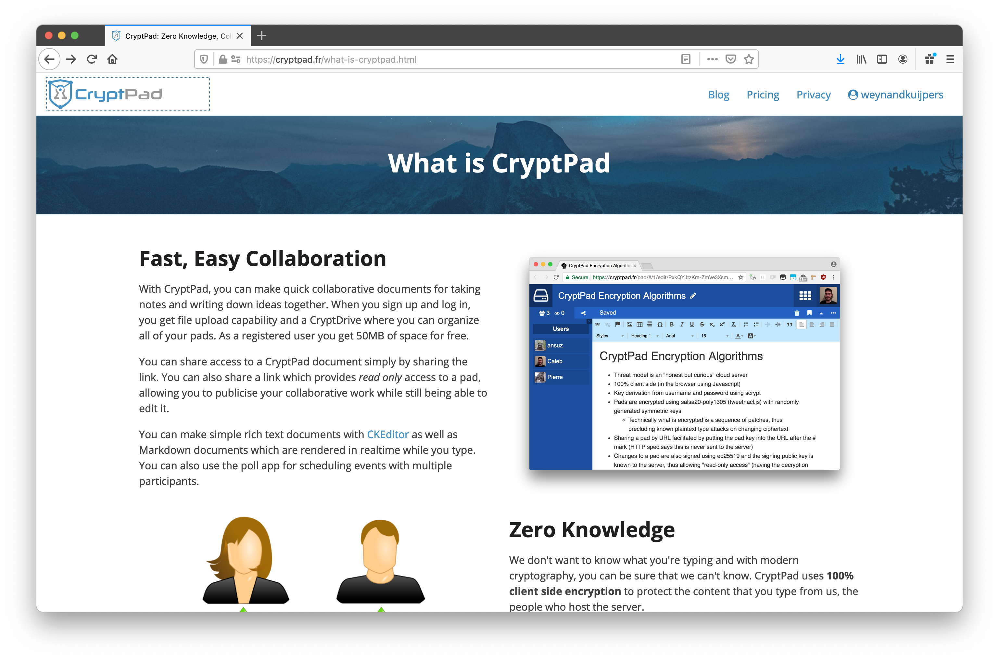
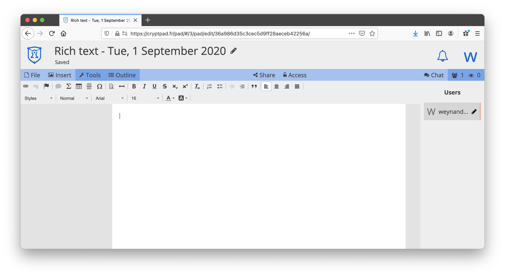
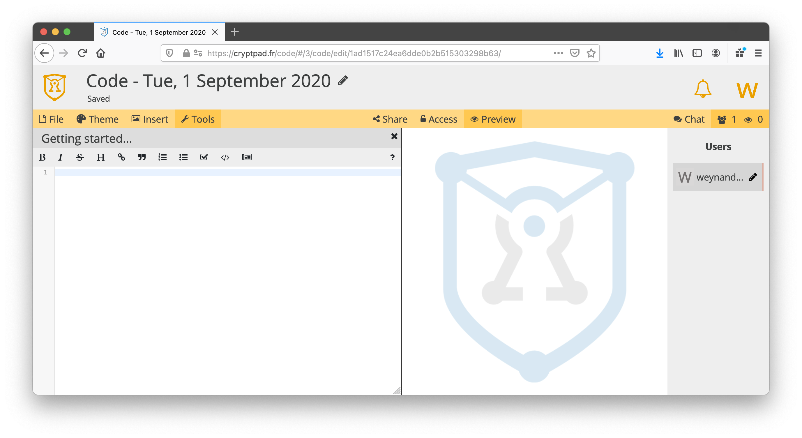
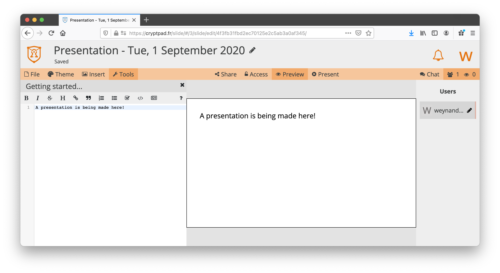
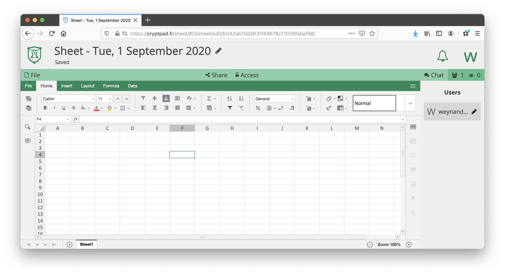
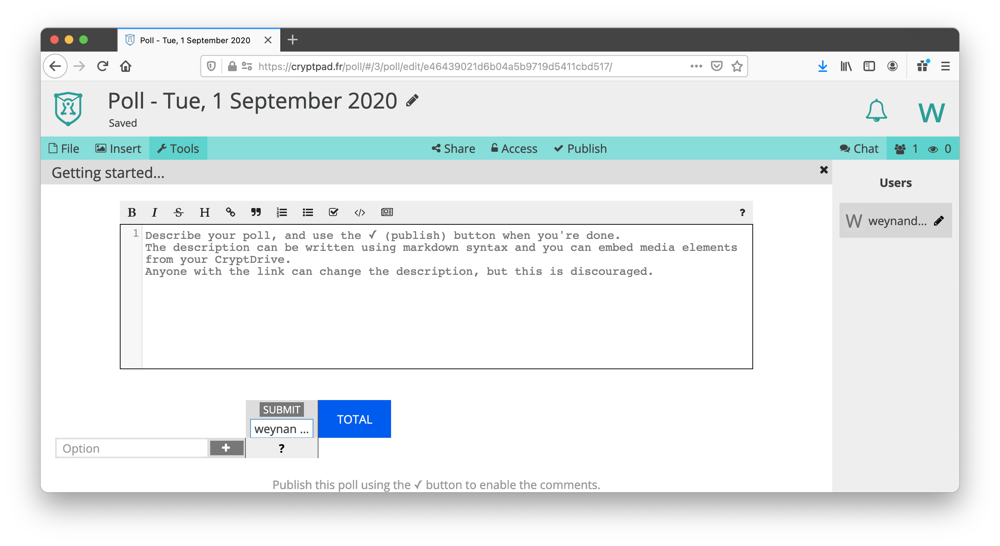
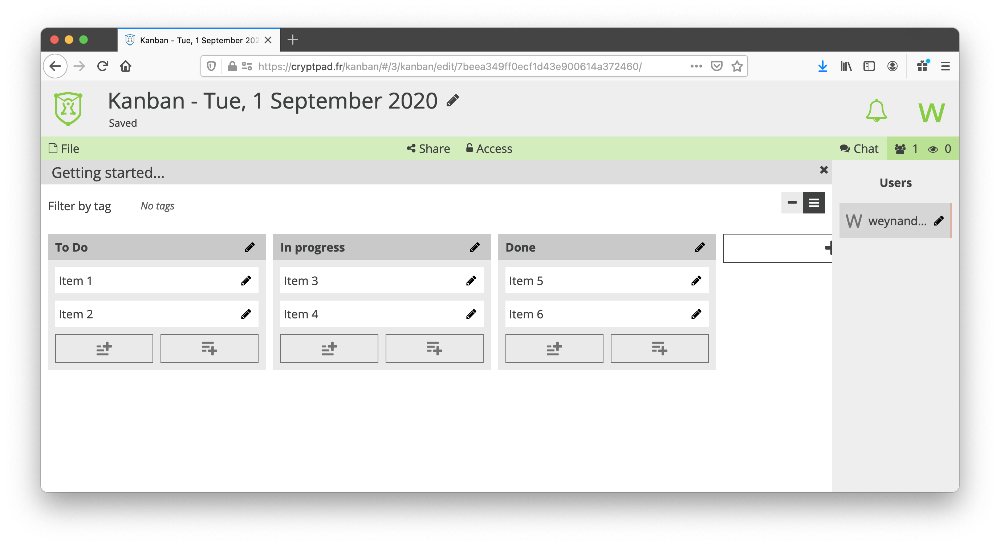
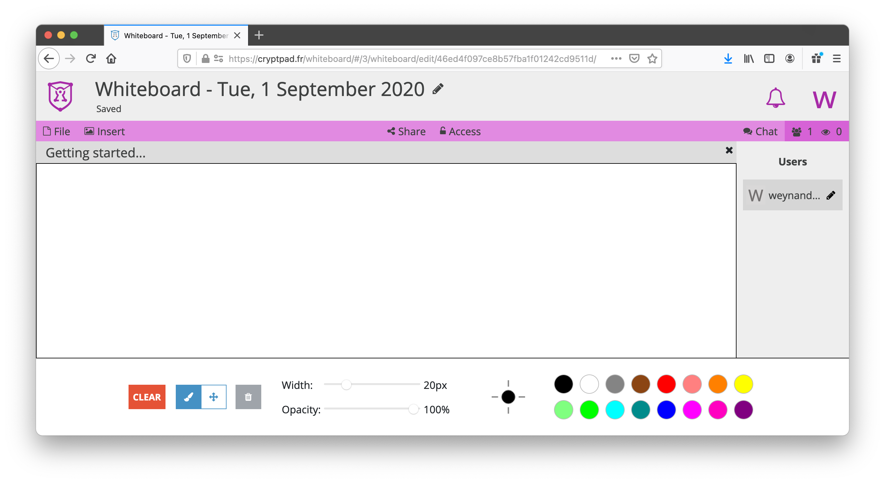
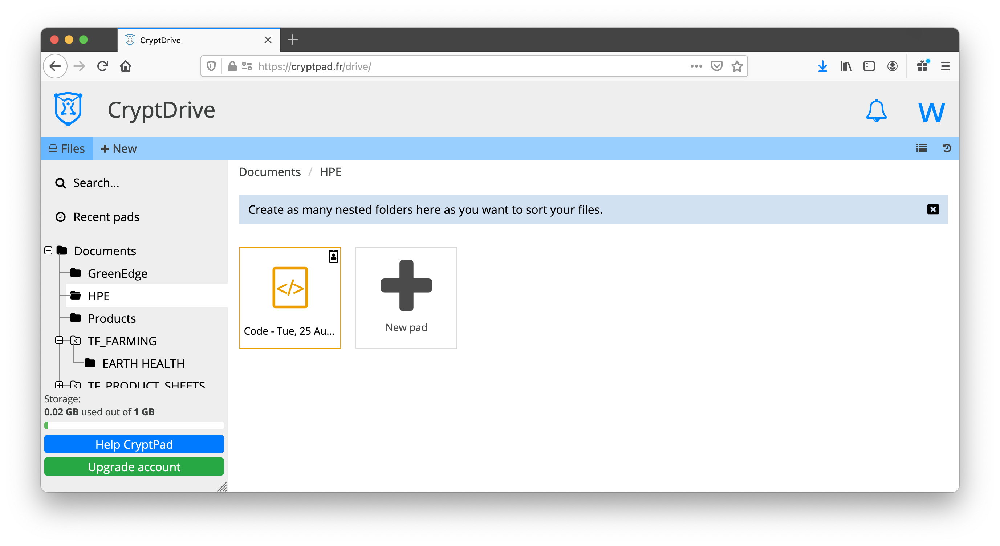

# Collaboration Tools: Office

## Current tools

The term "Office" refers to a family of software for people to create documents, spreadsheets and presentations with. The term was introduced by Gates on August 1, 1988, at COMDEX in Las Vegas. Initially a marketing term for an office suite (bundled set of productivity applications), the first version of Office contained Microsoft Word, Microsoft Excel, and Microsoft PowerPoint. Over the years, Office applications have grown substantially closer with shared features such as a common spell checker, OLE data integration and Visual Basic for Applications scripting language. Microsoft also positions Office as a development platform for line-of-business software under the Office Business Applications brand. On July 10, 2012, Softpedia reported that Office was being used by over a billion people worldwide.

Office (Micorsoft) has been very succesfull to become the defacto standard for people, students, businesses to create and collaborate on documents.  Over the years the office product suite moved from a local install to an online version (Office 365) and a number of other products have come to market to challenge that leading position (the google gdoc suite being the largest competitor)

The current set of online collaboration tools are available to anyone for a commercial fee or  free of charge.  The commercial packages are mostly used by businesses because it create a private environment but the free of charge version comes with terms and conditions that allow the service providers (Microsoft, Google, etc...) to benefit in a non monetary way by collecting data about usage  statistics and sometimes even content of the created documents.

ThreeFold believes that there should be a private and secure version of that those applications availabel to anyone.

## Affordable Private and Secure Office

Many alternatives are available to the the dominant office tools from Microsoft and Google, but ThreeFold endorses and supports CryptPad.fr open-source CryptPad project. It is administered by XWiki SAS, the employee-owned French company which created and maintains the product.

[CryptPad](https://cryptpad.fr/what-is-cryptpad.html) is a private-by-design alternative to popular office tools and cloud services. All the content stored on CryptPad is encrypted before being sent, which means nobody can access your data unless you give them the keys (not even us).  Encryption is happening in the browser that is used to access the "Pads" and therefore the central storage facility used does not see unencrypted data and only sees encrypted data passing by.

The ThreeFold team uses it for internal documents and collaboration, and now so can end-users on the ThreeFold Grid. The fucntionality includes:

### A richt text editor
This is an alternative to Word and Google Docs.  Is allows to create documents and collaborate with others to create documents.  Cryptpad supports multi user access to documents for co-editing and collaborations.  The sharing facility uses unique access keys allowing other to see the content unencrypted

### A code editor
The code editor 

### A presentation creation tool

### A spreadsheet creator and editor

### A poll creation tool

### A Kanban project management tool

### A Whiteboard tool

### An encrypted drive to store files.

Support cryptpad at https://cryptpad.fr/index.html

## How to Use

1) From the ThreeFold Now Solutions menu, click on the "CryptPad" button

2) Using the guided walkthrough, setup where you want your Solution to be hosted

3) Get started with creating documents with CryptPad! 
