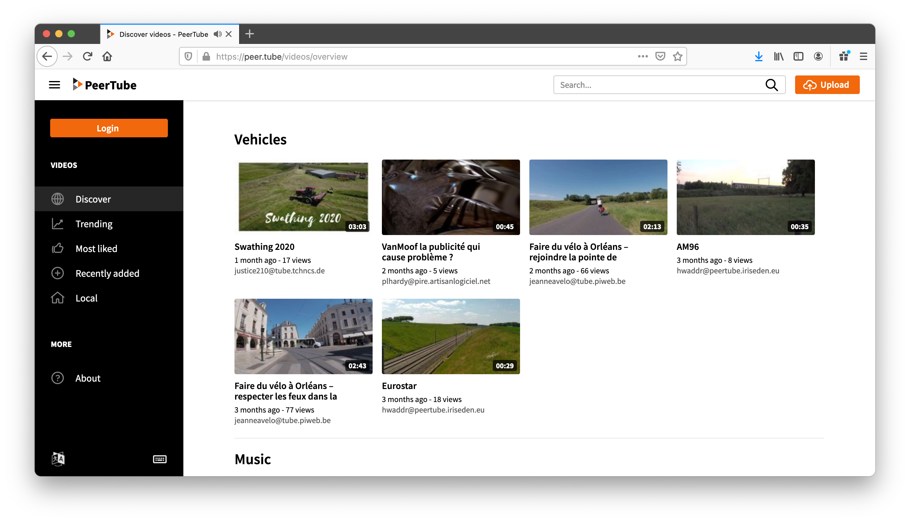
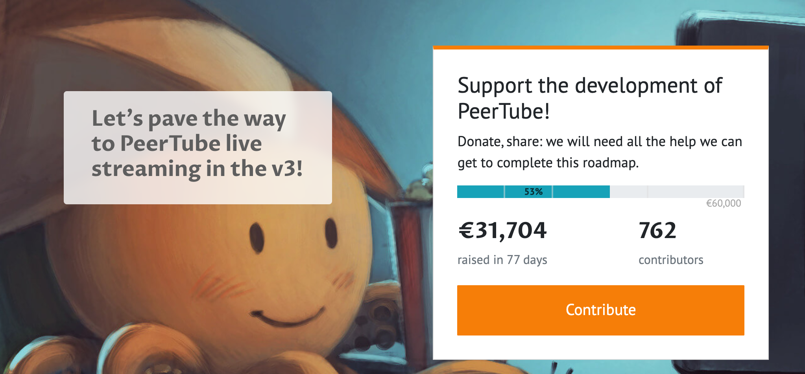

# Video Sharing

##  What is a video sharing platform?
In the 2010s, with the increasing prevalence of technology and the Internet in everyday life, video hosting services serve as a portal to different forms of entertainment (comedy, shows, games, or music), news, documentaries and educational videos. Content may be either be user-generated, amateur clips or commercial products. The entertainment industry uses this medium to release music and videos, movies and television shows directly to the public. Since many users do not have unlimited web space, either as a paid service, or through an ISP offering, video hosting services are becoming increasingly popular, especially with the explosion in popularity of blogs, internet forums and other interactive pages. The mass market for camera phones and smartphones has increased the supply of user-generated video. Traditional methods of personal video distribution, such as making a DVD to show to friends at home, are unsuited to the low resolution and high volume of camera phone clips. In contrast, current broadband Internet connections are well suited to serving the quality of video shot on mobile phones. Most people do not own web servers, and this has created demand for user-generated video content hosting.

The popularity of such video shrinf platforms have create large organisations to create platorm on which people and businesses can share their videos and most of these platforms have build a business model around tracking video consumptions interests and statitics and using this data for marketing purposes of theit oen or selling it to organisations for (big) data analysys.  They can do this because the platform forms the central hub (in a hub and spoke model) where the video producers can only reach video consumers by usnoig this platform.

ThreeFold advocates that video sharing can also exists without this central platform (and organisation) in the middle.  You as a producer or consumer can create your own personal, or for you social, sport and leasure activities, platform to share videos.  There is open software available to do so. ThreeFold endorses the [peertube] decentralised implementation of a video sharing platform.

## Decentralised video sharingn platform
PeerTube is a free and open source video platform that was officially launched on October 11, 2018, and is intended to offer an alternative to platforms such as YouTube, Vimeo, and Dailymotion. Similar to the open source Twitter alternative Mastodon, PeerTube is decentralized, meaning that it is not hosted by a single person, company, or server. Because it is open source, anyone can make their own “Instance” or PeerTube, which can have its own appearance, account management, moderation policy and so on.

Instances can also come together to form Federations, essentially several instances that agree on the same broadcast conditions and share their videos between them. Each video is stored by the Instance that published it but can be viewed by other Instances in the Federation. In turn, Federations are distinct and independent from one another.

Here is an official introductory video to PeerTube:

 <iframe width="1024" height="786"
src="https://www.youtube.com/watch?v=PJIsiuSdpq8&feature=youtu.be">
</iframe> 

Deploy your own youtube, super powerfull & decentralized.

Unique

- [X] private instance
- [X] peer2peer traffic
- [X] ...

> Help Peertube, they are fundraising, with little they can make this software even much better.

### Deploy

create widget which does following,
widget needs to be here in iframe

- [ ] size: small/mid/large
  - small: ...
  - mid: ...
  - large ...
- [ ] location (mention more locations coming soon)
  - Ghent
  - Vienna
- [ ] name
  - name as used in solution (in the webui and on web)
- [ ] domain (name is prefix of this)
  - ava.tf
  - 3x0.me
  - refit.earth
  - co30.org
  - ninja.tf
  - base.tf
  - tf9.io
- [ ] git url
  - check in wizard git url works
- [ ] sshkey yes/no
  - if yes, ask sshkey for remote login

  - always deploy on ipv6 public
  - always deploy on webgateway

- go to https://joinpeertube.org/roadmap to help