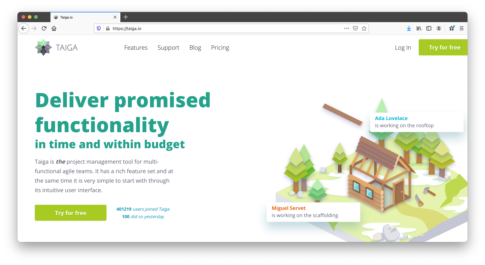
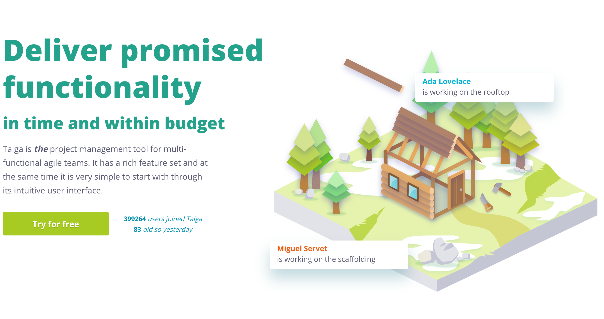
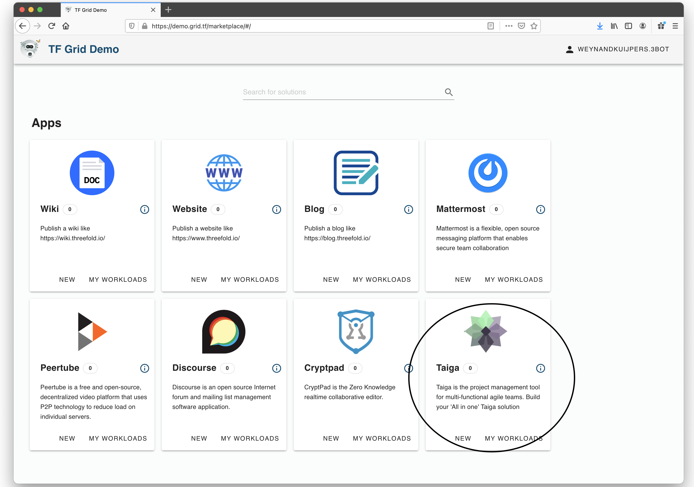
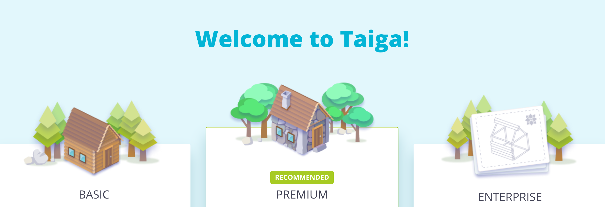

# Project Management

## Introductiom
We all use planning software for projects in a out personal and professional lives.  Over the last decade a moajpr shift has occured in the type of planning methodology mainly because of increased complexity in the world around us.  Originally we planned most project by using the waterwall method. The waterfall model is a breakdown of project activities into linear sequential phases, where each phase depends on the deliverables of the previous one and corresponds to a specialisation of tasks. 

## Waterfall method
Thge original waterfall model had a number of indentifified stages which are traversed in sequence:
- **Capture requirements** in a document _(I want a house with 4 bedrooms and 5 bathrooms and etc....)_.
- **Analyse the requirements** document and create a model, schema, and rules _(first sketches of the house, budget indications and timeline for build it)_.
- Use the model, schema and rules to **create a design**: resulting in an architecture _(final blueprints, final budget and timeline for building)_.
- Take the architecture as a blueprint and **build the solution** _(contractors start to appeart onsite, materials are procured and delivered and things start to move)_.
- Use the **solution for testing** which is the systematic discovery and overcoming of defects _(is the roof waterproof, are the windows opening, is all the plumbing working, does every room have network cables and electrivity)_.
- Once all the defects have been overcome **put the solution** to work.  Install, migrate, support, and maintain the system for the duration of its existence _(take ownershipof the house, find and secure maintenance contracts for the roof, plumbing and electrivity and have a happy live)_.

This sounds all familiar right, and for a very long time this sequential way of organising and creating things worked really well.  But things have become so comlpext around us and innnovation is happening very fast on all fronts that doing things sequential is no longer the best way to create things.  This are changing faster than the time it takes to get through all the phases in the waterfall method that a lot of changing are required during the different phases to items created in the previous phase which make the whole model stop operating.

## Agile principles
A new mothodology has been developed to do exctly the same (build a house) but allow for changes to happen in the process.  Pioneered by the software industry but adopted by many other industries today is the **Agile** development methodology to organise and run projects.  Agile promotes agility in running a project and lives by the following principles:
- **Individuals and interactions** over processes and tools
- **Working solutions** over comprehensive documentation
- **Customer collaboration** over contract negotiation
- **Responding to change** over following a plan 

In the description of the waterfall method we built a house, and most of us recognise the challenges that this presents.  During the build phase we see that it would be nice to have one additional windows here, or an extra power outlet there.  In that methodology once the build starts the architecture is set in stone and cannot be changes anymore (although in most cases it can and is done but at a very high price and usually leadign to delays in the delivery of the whole project. This is silly in these times where technologies that make up a house are chaging so fast that we know there will be changes, upgrade etc along the way.  So the Agile method embraces that thought and allows for changes to happen.  As stated in the principles make the whole project more people oriented and not systems, processes, contracts and strict following plans.

## Agile tool: Taiga
Taiga is a tool that allows you to run projects following the Agile principles.  It presents various (well known implementations of the Agile principles and allows you to manage any project in an Agile manner.

<!--
Prefer the page to be shown in a window, will leave the original image for easy switch back 

-->

Taiga is an [open source project](https://github.com/taigaio) and has a commercial [Software as a Service](https://taiga.io/) version for people that don't want to have the hassle of installing and maintaining it themselves

At ThreeFold we love the agility and functionality the Taigo project management software provides us with and are using it for a number of different projects we run internally.  These projects range from customer facing and partnehsip acquisition projects to ThreeFold Tech product and software development projects.  See the taiga system working here: https://circles.threefold.me/discover

This gives you the ability to have a "one click" solution to deploy your own project management system in many of the locations where the ThreeFold grid has capacity.  We love the Taiga project and encourage you to help Taiga by paying for a commercial license (https://taiga.io/pricing). We at Threefold are planning to ask Taiga to be able to pay for license fees using TFT as part of the deployment wizard

Deploying your own instance on the grid provides you with unique featuers like:

- **A private instance**.  It's your private instance running in you private virtual datacenter.
- **Choice of location**.  Any node on the TF Grid is able to run the Taiga instance and we will make more locations to deploy going forward.
- **Decentralised USer Authentication**.  ThreeFold uses a 2 Factor Authentication system that doe not rely on central storage of a username and password combination.  Finde more information [here](coders/../../../coders/3bot/3bot_authentication.md)

### Deploy

<!-->
create widget which does following,
widget needs to be here in iframe
-->

<!--

Need to create a better high level overview of the Taiga deployment
- [ ] size: small/mid/large
  - small: ...
  - mid: ...
  - large ...
- [ ] location (mention more locations coming soon)
  - Ghent
  - Vienna
- [ ] name
  - name as used in solution (in the webui and on web)
- [ ] domain (name is prefix of this)
  - ava.tf
  - 3x0.me
  - refit.earth
  - co30.org
  - ninja.tf
  - base.tf
  - tf9.io
- [ ] git url
  - check in wizard git url works
- [ ] sshkey yes/no
  - if yes, ask sshkey for remote login

  - always deploy on ipv6 public
  - always deploy on webgateway

-->
