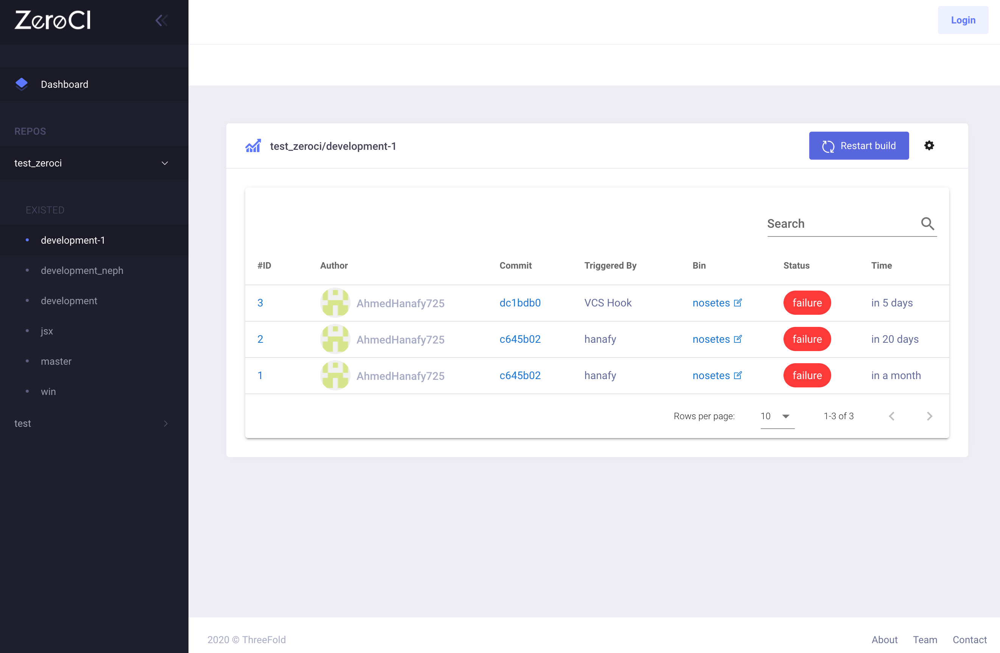

## ZeroCI

see https://github.com/threefoldtech/zeroCI

ZeroCI is continuous integration system useful for all languages but has some specific features for python projects that generates test summary into xml file and it is integrated with version control systems and Telegram.

(Note: version control systems supported are Github and Gitea)

<!-- The containers run on top of the ThreeFold grid.

### Deploy

create widget which does following,
widget needs to be here in iframe

- [ ] size: small/mid/large
  - small: 1 machine in test cluster
  - mid: 2 machines as part of cluster
  - large 5 machines as part of cluser
- [ ] location (mention more locations coming soon)
  - Ghent
  - Vienna
- [ ] name
  - name as used in solution (in the webui and on web)
- [ ] domain (name is prefix of this)
  - ava.tf
  - 3x0.me
  - refit.earth
  - co30.org
  - ninja.tf
  - base.tf
  - tf9.io
- [ ] git url
  - check in wizard git url works
- [ ] sshkey yes/no
  - if yes, ask sshkey for remote login

  - always deploy on ipv6 public
  - always deploy on webgateway

remarks

- deploy kubernetes automatically where all of this runs

## Manual

- link to manual
 -->
