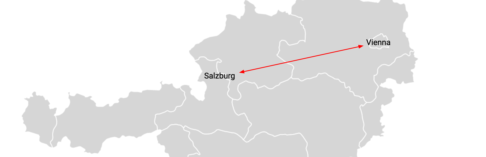

# Video Conferencing

### Introduction

Video conferencing has been around for a while and was mostly something for professional use cases or a replacement on mobile devices for a normal phone call.  This has changed dramatically with the 2020 Covid-19 pandemic where lockdowns in many areas globally have prevented people from traveling short and long distances.  So all of a sudden it was very important to not just hear another persons voice but also be able to connect visually.

Online services providing end user friendly video conferencing facilities where in high demand and many of the providers of such services have seen a tremendous increase in usage statistics.  Using centralized services for video conferencing creates silos of users that can communicate amongst each other because they use the same tool and it allows the man in the middle, the video conferencing platform to collect and market data captured by enduser usage.  Also the business model of the video conferencing platforms is to attract and capture a growing amount of users because that increase their companies market valuation.

When zoom became a very popular (free of charge) video conference solution they changed the policy of how you connected through their platform to others users.  If you have a free account, all free account users where connected through US based Zoom (central) infrastructure leading to very *inefficient* network capacity usage and a (very likely) potential oversight by US agencies and authorities.  This example is for 2 user of the zoom service with a free account based in Salzburg and Vienna.

In an ideal world two users would connect direct.  No need to make this connection go through any infrastructure that is not inline to make the connection. This can be done by creating a so called peer to peer video conferencing solution.

Such a peer-to-peer video conferencing solution has been created and exists on the TF Grid.  It has been designed and built by the ThreeFold Tech team and will have a one click deployment option.  The solution is called **FreeFlow connect**.

<!--

-->

<!-- ### Deploy

_The solution needs to appear in the threefold now one click solutions board.  Needs to be linked and an explanation (high level depending on how good the local explanation in the deployment process is needs to be provided here_

_create widget which does following,
widget needs to be here in iframe_ -->

<!--

- [ ] size: small/mid/large
  - small: ...
  - mid: ...
  - large ...
- [ ] location (mention more locations coming soon)
  - Ghent
  - Vienna
- [ ] name
  - name as used in solution (in the webui and on web)
- [ ] domain (name is prefix of this)
  - ava.tf
  - 3x0.me
  - refit.earth
  - co30.org
  - ninja.tf
  - base.tf
  - tf9.io
- [ ] git url
  - check in wizard git url works
- [ ] sshkey yes/no
  - if yes, ask sshkey for remote login

  - always deploy on ipv6 public
  - always deploy on webgateway
-->