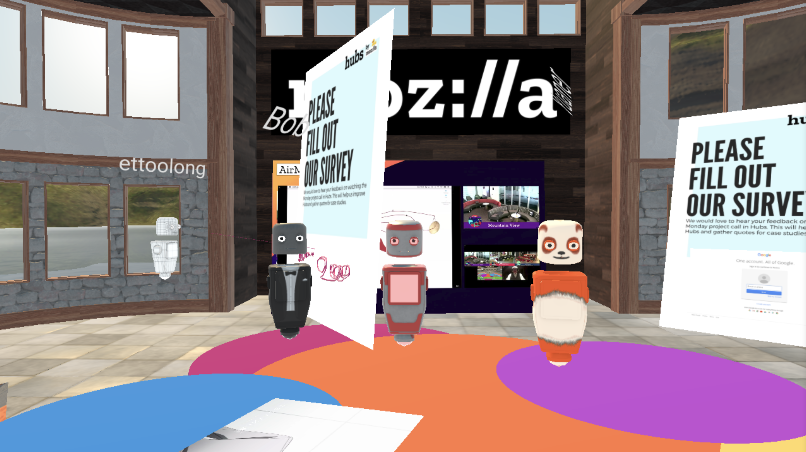

# Virtual Spaces

### Taking collaboration to the next level

Just like with video conferencing the recent pandemic ha schanged the way we collaborate and work together a lot.  Video conferencing is a much more accepted way to work, follow education and have family reunions and or parties.  Similar to that the ThreeFold Foundation expects that online collaboration is virtual spaces will take a flight as well as a tool to creates space to create together, to experience and collaborate on items.

Mozilla Hubs is a virtual collaboration platform that runs in your browser. With Hubs you can create your own 3D spaces with a single click. Invite others to join using a URL. No installation or app store required.

Hubs is for anyone who wants to connect with others remotely! It's a great way to bring communities together in a shared virtual space.

Host a conference, teach a class, showcase art, or just hang out with friends. Hubs makes it easy to connect and share images, videos, 3D models, and more. With Hubs' spatialized audio you can have conversations with everyone together or break out into smaller groups — just like you can in person.

Hubs works across platforms. Got a VR headset? Awesome! If not, you can use your desktop computer, laptop, tablet, or mobile devices to explore in 2D (see supported browsers).

Hubs is open source and customizable. Upload personalized avatars or create unique environments using Spoke.

For documentation please go [here](https://hubs.mozilla.com/docs/hubs-cloud-getting-started.html)

### Hubs on the ThreeFold grid

Hubs cloud is available on hosters that presents a centralised cloud platform solution or you can invest the effort to understand how to deploy a private instance of the software.  The TF Grid offers a 3 solution where you can either rent capacity anywhere on the TF Grid (please find the [explorer](https://explorer.grid.tf/) here) or even take the step of creating your own TF Grid capacity, earn some digital currency by doing so and have your own hosted infrastructure for you digital hubs where you feel confortable of having it.

More details coming soon!