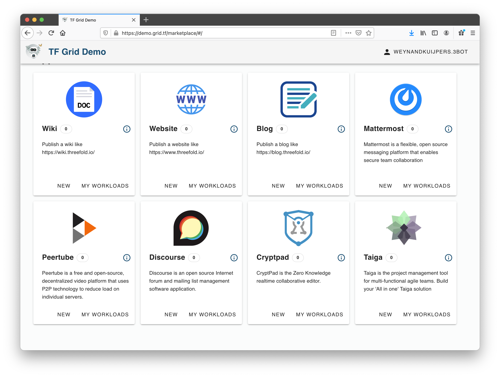

# Welcome to ThreeFold Now

ThreeFold has created the largest peer-to-peer cloud on the planet — but the internet is more than just storage and capacity. To fully realize the vision of an internet built for everyone, by everyone, we need easy-to-use and easy-to-deploy alternatives to the online tools and applications we use most. 

From publishing to video hosting, communication to project management, ThreeFold has developed a suite of turnkey solutions for end-users to create, share and build on the decentralized and secure ThreeFold Grid. 

**The internet of tomorrow, available today — this is ThreeFold Now.**  

## Why It Matters

While the current internet has plenty of apps, games and gadgets to keep you busy, they come with a few caveats: 

- "Free" but with a price. Many of these apps may be free to download and use, but what you may not know is that the companies providing these apps track and gather your personal information, online activity, and other data, which can then be sold to marketers, credit agencies and other third parties without your knowledge or consent. You might think you're getting a free product, but in reality it's the other way around — the product is actually you.

- Your content, their property. You spend countless hours creating and sharing content on social media, winning items in games, and building up a following. You'd think you own this digital "property", but think again — with most sites and platforms, the companies themselves actually own it, and use it to generate traffic and revenue without you receiving your fair share. And when you close your account or the game is discontinued, you lose your content and your access. 

This is the way it's always been, but is it fair? We at ThreeFold think not. Which is why we're releasing decentralized and user-owned alternatives where data privacy is essential, and your creative expression is yours. 
<!--
Layout will probably change to follow the 
- decentralised you
- decentralised web
- decentralised cloud
dividers.  

Image might to have to be updasted.
-->

## Features / Benefits

- Easy to deploy and ready to use 

- Create a decentralized instance that you entirely own and manage

- Full data privacy and ownership

- Securely hosted on the peer-to-peer ThreeFold Grid

- Pay only for the capacity that you use — no hidden fees or selling of your data

## How to Use 

Visit the ThreeFold Now dashboard here: 

- Choose the solution you want to launch from the menu

- Use the guided setup to create your solution

- Start building! 

The first set of initial solutions have been provided by ThreeFold, and more are on the way. The rest are up to you! Using our manual and SDK, anyone can create and implement a new solution on the ThreeFold Grid. What are you creating? Let us know! 
