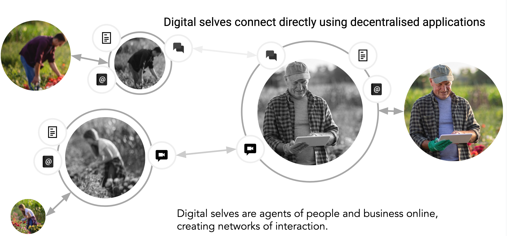

## Decentralised Web

With an online digital self representing you, and putting you in the center, you can make that digital self have capabilities that we know today as web services.  Where web services are centralised applications that provide a single functions, are owned by a single organisation and are competing for your attenting and want to keep you in a walled garden where they benefit from you using their service.

With the digital self put in the center we can reverse that model and make the digitial self a "platform of capabilities" that provide you with web services.  For example if digital selves can find other digital selves in a "phonebook" like manner that it would be fairly straightforward to send messages between two digital selves, wouldn't it?  No need any more to have an "email" provider (a third party that sits in the middle), or an instant message provider.  All that messagin (be it text, voice of video) can be created and delivered to the other digital self.

A similar thing is true for web other web applications.  For a Customer Relationship Management (CRM) systen you just install the application on your digitial self "platform" and you host your own application, managing storage and retrieval of you own data and allowing others (digital selves) to to access and share you data.  Simple, right? 

<!-- ThreeFold now is working on a growing set of decetralised web services for you to take forward.  The currenct list of services being worked on is: -->
- 